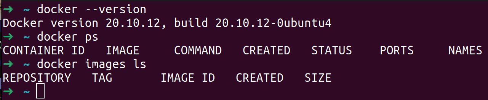

# Pre-Requisites for gCloud & Docker Setup

### Docker

1. Let us install [docker](https://docs.docker.com/engine/install/).If you are mac user please follow [this](https://docs.docker.com/desktop/mac/install/).

2. Let us now create account on [DockerHub](https://hub.docker.com/).


3. For mac OR windows please install `docker desktop` then run & start the `docker engine`.

4. If you have linux then you just have to install docker then turn on docker engine.

5. Ensure docker is installed as per below image.



### Installing gCloud

1. On google [cloud](https://cloud.google.com) create account and navigate to console.


2. Let us add `credit card` when we login.

3. Credit card will not be charged as long as we are staying with in the `free tier`. we will delete the cluster as soon as we are done, so no issues.

4. Please click on `Go to console` button. Notice the `My first project` on left upper side corner. This is shown in the screenshot below.


5. Please set up `billing account` look at the screenshot below.


**gCloud SDK**

1. Please install gCloud [SDK](https://cloud.google.com/sdk/docs/install).

2. In below image please select your OS.


3. Install it and check the version like below.


4. Ensure that gcloud directory is included in the path variable.

5. Enter the `gcloud auth` to authenticate to GCP.

```
gcloud auth
```

6. This command will open another browser and ask permission. This will wire the gcloud permission from UI to our local shell.

7. This command will initialize the gcloud CLI.

```
gcloud init
```


8. Click on `top-left main menu symbol` then scroll. As shown in the image below,


9. Please use `compute engine` so you can click on compute engine then you will get option for `Enable the API`.


10. Also enable `kubernetes engine API`.


### Creating Service Account

We have create a new project then there is by default Compute Engine default service account available after then we have to create a new service account with 5 roles which is mentioned below.

1) Compute Engine Service Agent
2) Kubernetes Engine Service Agent
3) Container Registry Service Agent

After then create the json key then add it in the main.tf and also change the project name as per your project name.

<!-- 
```
gcloud iam service-accounts create helm-sa-1 --display-name "Helm Service Account"


gcloud projects add-iam-policy-binding concrete-detection-2 \
    --member "serviceAccount:helm-sa@concrete-detection-2-iam.gserviceaccount.com" \
    --role "roles/kubernetes.serviceAgent"

gcloud projects add-iam-policy-binding concrete-detection-2 \
    --member "serviceAccount:helm-sa@concrete-detection-2-iam.gserviceaccount.com" \
    --role "roles/compute.serviceAgent"

gcloud projects add-iam-policy-binding concrete-detection-2 \
    --member "serviceAccount:helm-sa@concrete-detection-2-iam.gserviceaccount.com" \
    --role "roles/container.serviceAgent"
```


```
gcloud iam service-accounts keys create ./terraform/helm-key.json \
  --iam-account helm-sa@concrete-detection-2.iam.gserviceaccount.com
``` -->


that's it you are good to go with service account.

11. Let us follow the [README.md](README.md#project-overview).


## Thank you... :)